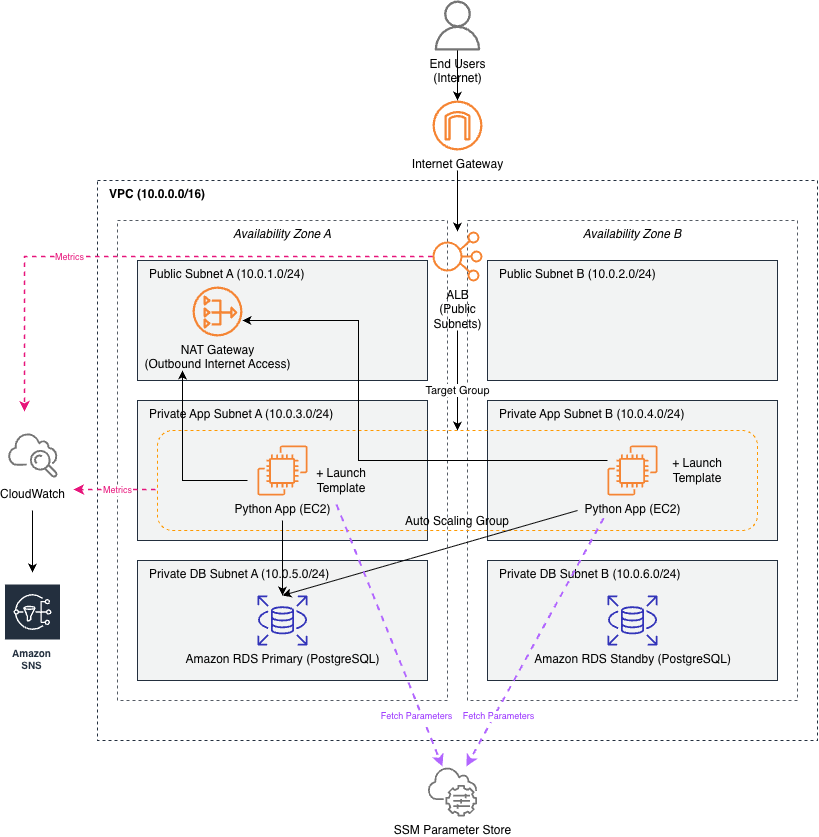

# Multi-AZ AWS Web Infrastructure

This project demonstrates how to provision a production-style AWS application architecture using Terraform.

The infrastructure deploys a highly available web application across multiple Availability Zones using an Application Load Balancer, Auto Scaling Group and Amazon RDS.

---

# Architecture Overview

The system consists of the following components:

- **VPC** with public and private subnets across two Availability Zones
- **Application Load Balancer (ALB)** for distributing incoming HTTP traffic
- **Auto Scaling Group (ASG)** running EC2 instances in private subnets
- **Amazon RDS PostgreSQL** database deployed with Multi-AZ failover
- **AWS Systems Manager Parameter Store** for storing database configuration
- **CloudWatch alarms and SNS notifications** for infrastructure monitoring

Application instances retrieve database configuration from SSM Parameter Store during startup and connect to the RDS instance.

---

## Architecture Principles

This architecture was designed following several core cloud design principles:

- High availability across multiple Availability Zones
- Secure network segmentation using private subnets
- Infrastructure managed entirely through Terraform
- Secret management using AWS SSM Parameter Store
- Automated recovery using Auto Scaling

---

# Architecture Diagram

# Terraform Structure

The Terraform code is organised into reusable modules.

- vpc
- alb
- compute
- rds

Each module is responsible for a specific infrastructure component.

| Module   | Purpose                                            |
|----------|----------------------------------------------------|
| VPC      | Networking, subnets, routing, NAT gateway          |
| ALB      | Application Load Balancer and target groups        |
| Compute  | Launch template, Auto Scaling Group, EC2 instances |
| RDS      | PostgreSQL database deployment                     |

---

# Application

A simple Python HTTP server runs on each EC2 instance.

Endpoints include:

| Endpoint | Description                                       |
|----------|---------------------------------------------------|
| /health  | Used by the ALB health check                      |
| /db      | Executes a test query against PostgreSQL          |
| /az      | Returns the Availability Zone serving the request |

---

# Design Decisions

### Private Subnets for Compute

Application EC2 instances are deployed in private subnets so they are not directly reachable from the public internet.  
All inbound traffic to the application must pass through the Application Load Balancer.

This significantly reduces the attack surface by preventing direct access to the compute layer.

Outbound internet access (for package installation, updates, and retrieving parameters) is provided via a NAT Gateway located in a public subnet.

This design follows AWS security best practices by isolating application infrastructure while still allowing controlled outbound connectivity.

---

### Application Load Balancer

An Application Load Balancer (ALB) is deployed in public subnets and acts as the entry point for all user traffic.

The ALB distributes incoming HTTP requests across EC2 instances running in multiple Availability Zones using a target group.

Health checks are configured on the /health endpoint to ensure that traffic is only routed to healthy application instances.

This architecture improves both availability and resilience by automatically removing unhealthy instances from service.

---

### Auto Scaling Group

EC2 instances are managed by an Auto Scaling Group (ASG), which ensures that a desired number of application instances are always running.

The ASG distributes instances across multiple Availability Zones to improve fault tolerance.

If an instance becomes unhealthy or fails, the ASG automatically terminates it and launches a replacement.

This mechanism provides self-healing infrastructure and allows the application layer to scale horizontally based on demand.

---

### RDS Multi-AZ Deployment

The database layer is implemented using Amazon RDS for PostgreSQL.

Multi-AZ deployment is enabled, which provisions a synchronous standby database in a second Availability Zone.

If the primary database becomes unavailable, RDS automatically performs failover to the standby instance.

This provides high availability and minimizes downtime without requiring manual intervention.

The database is placed in isolated private database subnets to prevent direct internet access.

---

### SSM Parameter Store

Database connection information (host, port, username, password, database name) is stored securely in AWS Systems Manager Parameter Store.

Sensitive values such as the database password are stored as SecureString parameters.

During instance startup, EC2 retrieves these values using the AWS CLI and injects them into the application environment.

This avoids hardcoding credentials in the application code or Terraform configuration and enables centralized secrets management.

---

### CloudWatch Monitoring

CloudWatch is used to monitor infrastructure health and application performance.

Key metrics such as EC2 CPU utilization and ALB HTTP error rates are tracked.

CloudWatch alarms trigger when defined thresholds are exceeded and publish notifications to an SNS topic.

This enables operational visibility and provides a mechanism for alerting when the system experiences abnormal behavior.

---

# How to Deploy

### 1. Clone the repository

git clone https://github.com/yourusername/terraform-aws-multi-az-webapp.git
cd terraform-aws-multi-az-webapp

### 2. Create your variables file

Copy the example variables file and update values if necessary.

cp terraform.tfvars.example terraform.tfvars

### 3. Initialize Terraform

terraform init

### 4. Review the infrastructure plan

terraform plan

### 5. Deploy the infrastructure

terraform apply

After deployment, the application can be accessed via the ALB DNS name.

---

# Example

- curl http://ALB-DNS/health
- curl http://ALB-DNS/db
- curl http://ALB-DNS/az

---

# Cleanup

- terraform destroy

---

# Technologies Used

- AWS
- Terraform
- Python
- Amazon Linux 2023
- PostgreSQL
